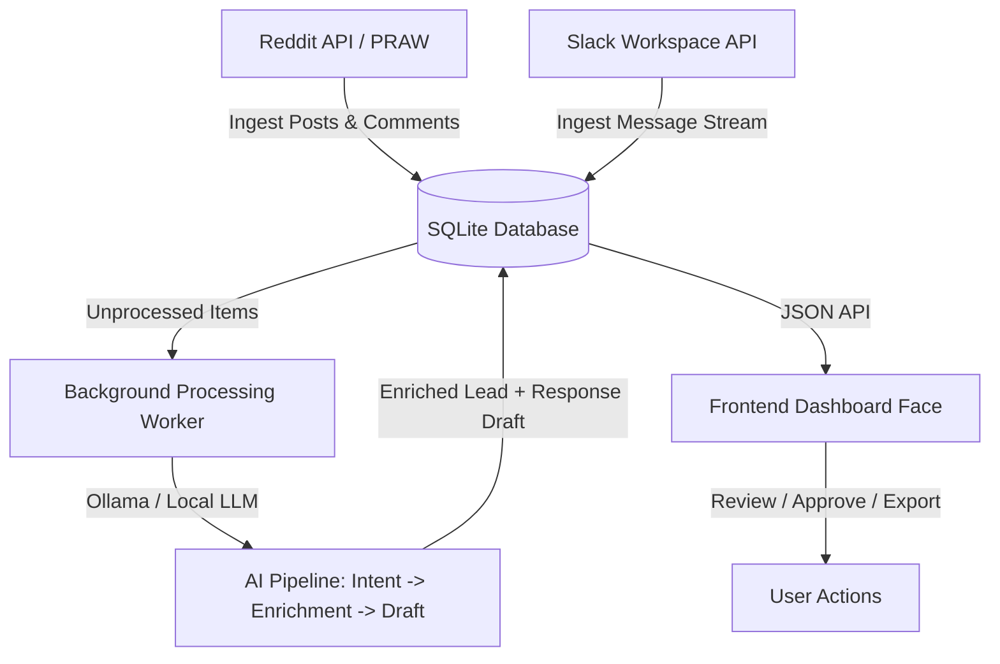

# Product Requirements Document (PRD): Jager

**Version:** 1.0.0  
**Status:** Approved  
**Author:** Jimmy Pang & Antigravity  

---

## 1. Executive Summary

**Jager** (German for "Hunter") is an open-source, AI-native lead generation and opportunity-finding system. It is designed to act as an automated, background scout that monitors community channels—primarily **Reddit** and **Slack**—to locate high-intent buying signals, partnerships, and hiring opportunities.

Jager is architected to be **backend & data-heavy**, focusing on high-quality ingestion, database caching, and AI-driven filtering, with a lightweight, clean frontend "face" serving as a dashboard to review, edit, and act upon generated leads.

---

## 2. Goals & Value Proposition

- **High-Intent Signal Discovery:** Surface active discussions where users are looking for product recommendations, asking for help with a problem your business solves, or posting job/consulting openings.
- **Privacy & Local-First:** By default, use **Ollama** for AI inference, keeping data local, private, and free of ongoing API costs.
- **Personalized Contextual Drafts:** Generate highly customized, non-spammy responses tailored to the specific context of the thread.
- **Zero-Noise Filtering:** Use LLMs to classify threads, ensuring that only true leads reach the dashboard, filtering out generalized discussions or self-promotions.

---

## 3. Architecture & Data Flow

Jager uses a pipeline pattern consisting of:
1. **Ingestion Layer:** Periodic cron-like worker pulling data from sources (Reddit API, Slack Webhook/Events API).
2. **Persistence Layer:** A local SQLite database storing raw posts, comments, metadata (votes, timestamps), and processed leads.
3. **AI Pipeline (Ollama):** Local LLM classification, metadata extraction, and draft response generation.
4. **Dashboard Interface (Frontend Face):** A clean, modern UI for browsing leads, updating configuration, and exporting data.

---

## 4. Feature Specifications

### 4.1 Ingestion Engines

#### A. Reddit Engine (Official API)
*   **Scope:** Monitor specific subreddits (e.g., `r/smallbusiness`, `r/indiebiz`, `r/saas`, `r/consulting`).
*   **Data Captured:**
    *   Submission details: Title, selftext, URL, author, score (upvotes/downvotes), upvote ratio, creation timestamp.
    *   Comment trees: Top-level and nested comments, scores, authors, depth.
*   **Execution:** Periodic background execution (every 15–30 minutes) fetching new and rising submissions.

#### B. Slack Engine (Official API)
*   **Scope:** Listen to specific public channels in configured Slack workspaces (e.g., `Locally Optimistic`, developer communities).
*   **Data Captured:** Message content, sender, timestamp, channel ID, thread parent ID (for thread context tracking).
*   **Execution:** Event-driven listening via Slack Webhook/Events API, or recurring polling of channel history.

---

### 4.2 AI Processing Pipeline

The pipeline processes new items in the SQLite database through three stages:

1.  **Intent Detection (Classification):**
    *   *Input:* Post title, content, author, context.
    *   *LLM Action:* Classifies if the text represents a high-intent opportunity (buying signal, job opening, direct problem statement) or is informational/irrelevant.
2.  **Lead Enrichment (Metadata Extraction):**
    *   *Input:* Confirmed high-intent text.
    *   *LLM Action:* Extracts structured metadata (e.g., Primary Pain Point, Budget, Technologies Mentioned, Decision Maker Name/Handle, Urgency Level).
3.  **Draft Response Generation:**
    *   *Input:* Enriched lead info + User's context/offering profile.
    *   *LLM Action:* Drafts a personalized response outline or complete message template that offers value first, avoiding boilerplate sales pitches.

---

### 4.3 Database Schema (SQLite)

*   `sources`: Configuration for subreddits and Slack channels.
*   `raw_posts`: Stores ingested posts, messages, comments, scores, and raw JSON payloads.
*   `leads`: Stores processed entries categorized as high-intent, including their extracted metadata.
*   `drafts`: Stores AI-generated responses associated with leads.
*   `settings`: General configurations (Ollama model names, user profile context, API keys).

---

### 4.4 Frontend "Face" Dashboard

A clean single-page dashboard built with React and Vite:
-   **Leads Inbox:** Kanban board or list view of generated leads sorted by urgency or upvotes.
-   **Lead Detail View:** Displays original post, comment context, extracted metadata, and the AI-drafted reply.
-   **Quick Actions:**
    *   *Copy Draft:* Copy the generated draft response to clipboard.
    *   *Status Change:* Move leads between "Inbox", "Contacted", "Ignored", and "Converted".
    *   *Export:* Export selected leads as CSV or JSON.
-   **Configuration Panel:** Update profile description (what your business does to tailor drafts), configure subreddits/Slack channels, and adjust LLM parameters (Ollama port, model target).

---

## 5. Technical Requirements & Stack

-   **Backend:** Node.js (TypeScript) or Python (FastAPI). Python is highly recommended due to PRAW library and standard data wrangling capabilities.
-   **Database:** SQLite (local file, zero configuration required).
-   **AI Integration:** Ollama (defaulting to models like `llama3`, `mistral`, or `phi3`). Extensible to OpenAI/Gemini APIs via optional environmental variables.
-   **Frontend:** React (Vite) + Tailwind CSS/Vanilla CSS, communicating via a local REST API.
