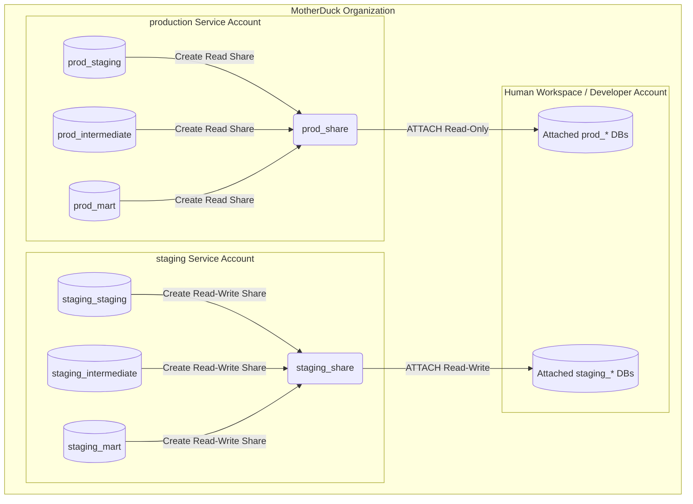

# MotherDuck Environment & Architecture Best Practices

This document outlines the architecture patterns, environment separation mechanics, and best practices for using MotherDuck as the primary OLAP database in the Jager project.

---

## 1. Core Architecture Pattern
MotherDuck recommends separating environments by **databases, compute scopes, and service accounts**, rather than physically duplicating or copying raw data between "production" and "staging". 

### Key Design Principles:
* **Workload-Based Databases**: Split databases by responsibility and stage of lifecycle (e.g., `raw`, `transform`, `marts`) rather than generic `dev/stage/prod` monolithic DBs.
* **Isolated Service Accounts**: Assign a dedicated service account and access token for each distinct workload (e.g., ingestion vs. transformation) and environment (dev, staging, prod).
* **Read-In-Place Analytics**: Analytics and transformation layers should query production raw data in place (via secure, read-only Shares) and write their outputs into separate, isolated environment databases.
* **No Redundant Copies**: Avoid copying raw data unless strictly required by compliance or data masking regulations.

---

## 2. Environment Separation Mechanics

To separate development, CI, and production environments, implement the following sharing model:



### Steps to Implement:
1. **Expose Ingested Data**: Create a read-only Share of the production raw database:
   ```sql
   CREATE SHARE raw_prod_share FROM raw_prod (ACCESS ORGANIZATION, VISIBILITY DISCOVERABLE);
   ```
2. **Attach the Share**: In the target environment (e.g., dev or CI), attach the share:
   ```sql
   ATTACH 'raw_prod_share' AS raw;
   ```
3. **Execute Transformations**: Pipelines or `dbt` run queries reading from the `raw` share and write outputs directly to isolated databases (e.g., `transform_dev` or `transform_ci`).
4. **Promotion & Rollbacks**:
   - **Promotion**: Run the exact same transformation code against the production target database (`transform_prod`).
   - **Rollback**: Take snapshots on the production database to rollback changes immediately:
     ```sql
     CREATE SNAPSHOT backup_snapshot ON transform_prod;
     -- To restore:
     ALTER DATABASE transform_prod SET SNAPSHOT backup_snapshot;
     ```

---

## 3. Naming Conventions & Structure

Our architecture defines two core service accounts (`production` and `staging`) to manage distinct database clusters and enforce strict access control:

### Service Accounts & Database Ownership

#### 1. `production` Service Account (SA)
- **Role**: Manages and writes production OLAP datasets.
- **Database Ownership**:
  - `prod_staging` (Ingestion/landing area)
  - `prod_intermediate` (Data preparation/cleaning)
  - `prod_mart` (Analytics-ready dimensional models)
- **Permissions**: Shares **read-only access** to the entire organization, allowing human developers and BI tools to safely query production metrics without risk of modifying data.

#### 2. `staging` Service Account (SA)
- **Role**: Manages staging/CI and development database targets.
- **Database Ownership**:
  - `staging_staging` (Ingestion/landing area)
  - `staging_intermediate` (Data preparation/cleaning)
  - `staging_mart` (Staging dimensional models)
- **Permissions**: Shares **read and write access** to the entire organization, allowing developers to query, test, and write validation data during active development.

### dbt Multi-Target Profile Configuration (`profiles.yml`):
```yaml
jager_olap:
  target: dev
  outputs:
    dev:
      type: postgres  # Or Motherduck/DuckDB connector
      host: pg.us-east-1-aws.motherduck.com
      database: staging_mart
      user: postgres
      password: "{{ env_var('MOTHERDUCK_STAGING_TOKEN') }}"
      port: 5432
      threads: 4
    prod:
      type: postgres
      host: pg.us-east-1-aws.motherduck.com
      database: prod_mart
      user: postgres
      password: "{{ env_var('MOTHERDUCK_PRODUCTION_TOKEN') }}"
      port: 5432
      threads: 8
```

---

## 4. Handling Sensitive Data

When working with regulated or PII data that cannot be exposed to lower environments:
1. Create a sanitized, masked, or anonymized copy of the raw production data inside production:
   ```sql
   CREATE DATABASE raw_sanitized;
   -- Populate with masked records...
   ```
2. Share the sanitized database to lower environments instead of the true raw database:
   ```sql
   CREATE SHARE raw_sanitized_share FROM raw_sanitized (ACCESS ORGANIZATION);
   ```
3. Non-production environments attach `raw_sanitized_share` while production pipelines attach `raw_prod_share`. The code remains identical, but the source data is securely isolated.

---

## 5. Design Decisions & Questions for Jager

As we expand the MotherDuck integration, the following decisions will shape our configuration:

* **Tenant Architecture**: Are we building a single-tenant workspace or a multi-tenant structure (separate raw/marts databases and service accounts per customer)?
* **Isolation Scope**: Do we require hard isolation (separate MotherDuck organizations for staging and production) or soft isolation (separate service accounts and databases within the same organization)?
* **Transformation Tools**: Are we transitioning to `dbt` as our primary SQL transformation layer, or continuing with custom Python/N8N workflows?
* **Visibility Preferences**: Should non-technical business users see the staging databases in the MotherDuck Web UI, or should staging/dev databases be hidden shares accessible only to developer accounts?
