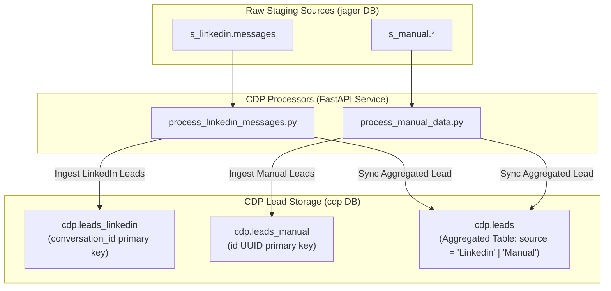
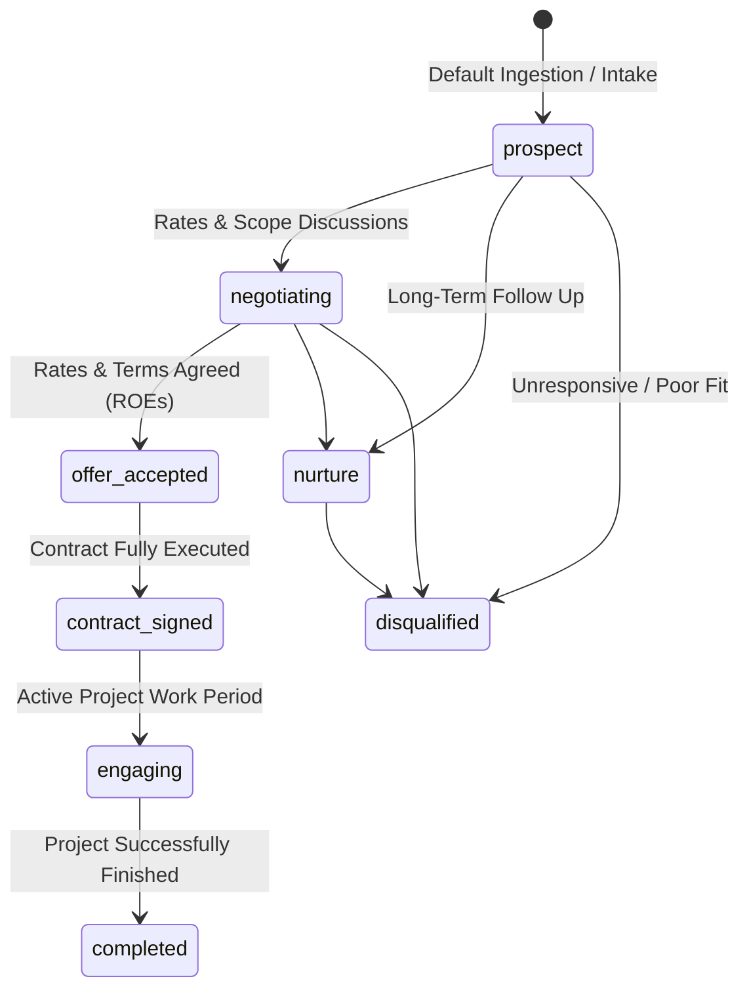
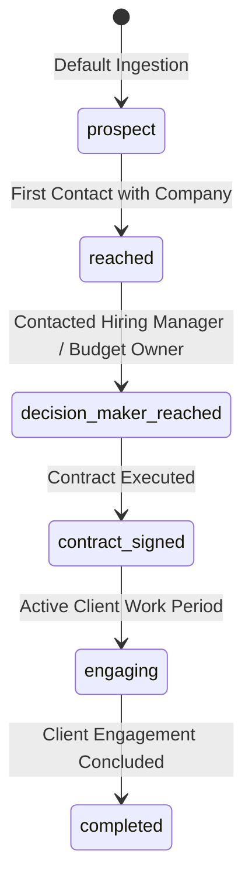

# Customer / Client Data Platform (CDP) Service

The **CDP Service** is a dedicated FastAPI microservice responsible for core Customer/Client Data Platform processing in Jager.

A Customer Data Platform (CDP) acts as the unified system of record for managing all **Leads** (`cdp.leads`, with specialized intake tables `cdp.leads_linkedin` and `cdp.leads_manual`), **Persons/Contacts** (`cdp.persons`), **Client Companies/Accounts** (`cdp.client_accounts`), **Person-Account Relationships** (`cdp.person_account_relationships`), and **Client Engagements** (`cdp.engagements`). Similar to enterprise platforms like Snowplow or Braze, it provides a centralized, 360-degree overview of client interactions and ongoing project engagements.

---

## Core Domain Model & Responsibilities

Unlike analytical ETL pipelines (which live under `src/data_pipelines/` for loading MotherDuck OLAP tables), the CDP service executes core operational domain logic directly on the PostgreSQL `cdp` schema.

### Key Functional Domains:
1. **Entities & Identity Resolution**:
   - **`cdp.persons`**: Individual contacts and prospect profiles, resolved by primary email or LinkedIn URL.
   - **`cdp.client_accounts`**: Target client companies, organizations, and accounts extracted from sources (e.g. LinkedIn connections).
   - **`cdp.person_account_relationships`**: Mapping individual contacts to client accounts with specific roles (e.g. decision maker, job position) and employment status.
2. **Lead Intake & Opportunity Lifecycle**:
   - **`cdp.leads_linkedin`**: Intake table for LinkedIn message-derived leads (`s_linkedin.messages`).
   - **`cdp.leads_manual`**: Intake table for manual data-derived leads (`s_manual`).
   - **`cdp.leads`**: Aggregated physical table consolidating LinkedIn and Manual leads, featuring a `source` column (`Linkedin` or `Manual`).
3. **Activities Domain**:
   - **`cdp.activities_notion_meeting_notes`**: Intake table sourced from Notion meeting notes (`s_notion.meeting_notes`).
   - **`cdp.activities`**: Consolidated activity entity table, populated solely from `cdp.activities_notion_meeting_notes` (extensible to future activity sources).
4. **Client Engagement & Activity Overview**:
   - **`cdp.engagements`**: Activity log tracking touchpoints (emails, calls, meetings, notes, form submissions, LinkedIn messages) for complete client engagement visibility.
5. **Automation Endpoints**:
   - Exposes REST HTTP endpoints consumed by n8n workflows (accessed via `CDP_SERVICE_URL`, e.g. `http://cdp:8000`).

---

## Data Flow Architecture



---

## Status Lifecycles & State Transitions

### 1. Lead Opportunity Status Lifecycle (`cdp.leads.status`)

The `cdp.leads` table tracks business opportunity leads. The status follows an 8-stage lifecycle from initial intake/prospecting to rate negotiation, contract execution, active engagement, nurture, or disqualification.



#### Lead Stage Definitions (`cdp.leads.status`)

| Status Value | Stage Name | Description & Trigger Criteria |
| :--- | :--- | :--- |
| `prospect` | **Prospect** | Default state upon lead intake/ingestion. No negotiation initiated yet. |
| `negotiating` | **Negotiating** | Active negotiations around project scope, daily rate (EUR/day), and contract terms. |
| `offer_accepted` | **Offer Accepted** | Both sides agree on daily rate and Rules of Engagement (ROEs) before formal contract signing. |
| `contract_signed` | **Contract Signed** | MSA / SOW contract fully signed and executed. |
| `engaging` | **Actively Engaging** | Currently executing active project work during the engagement period. |
| `completed` | **Engagement Completed** | Project engagement successfully completed. |
| `nurture` | **Nurture** | Lead is not cold, but not yet ready for immediate negotiation; periodic follow-up. |
| `disqualified` | **Disqualified** | Catch-all state for disqualified, unresponsive, or unviable leads. |

---

### 2. Client Account Status Lifecycle (`cdp.client_accounts.status`)

The `cdp.client_accounts` table represents target organizations. It follows a streamlined 6-stage lifecycle tracking the overall company-level relationship.



#### Client Account Stage Definitions (`cdp.client_accounts.status`)

| Status Value | Stage Name | Description & Trigger Criteria |
| :--- | :--- | :--- |
| `prospect` | **Prospect** | Default state upon company ingestion. No active contact established yet. |
| `reached` | **Reached** | Initial contact established with company representative(s). |
| `decision_maker_reached` | **Decision Maker Reached** | Contact established with key stakeholder who owns budget or hires for roles. |
| `contract_signed` | **Contract Signed** | Formal organization-level contract / SOW signed. |
| `engaging` | **Actively Engaging** | Company currently has active ongoing engagement/work. |
| `completed` | **Completed** | Company engagement successfully finished. |

---

## Directory Structure

```text
src/cdp/
├── Dockerfile                  # Container definition for CDP service
├── requirements.txt            # Python dependencies (FastAPI, SQLAlchemy, psycopg2)
├── main.py                     # FastAPI application endpoints
├── utils.py                    # Database connection & logging helpers
└── processors/                 # Core domain processors & handlers
    ├── process_linkedin_connections.py  # Normalizes LinkedIn connections into cdp.persons, cdp.client_accounts, and cdp.person_account_relationships
    ├── process_linkedin_messages.py     # Processes s_linkedin.messages into cdp.leads_linkedin and cdp.leads
    ├── process_manual_data.py           # Processes s_manual schema tables into cdp.leads_manual, cdp.leads, cdp.persons, and cdp.client_accounts
    └── process_notion_meeting_notes.py  # Ingests Notion meeting notes into cdp.activities_notion_meeting_notes and populates cdp.activities
```

---

## API Endpoints

* `GET /health`: Service health check.
* `POST /process/linkedin_connections`: Runs the processor to normalize raw connections from `s_linkedin.connections` into `cdp.persons`, `cdp.client_accounts`, and `cdp.person_account_relationships`.
* `POST /process/manual_data`: Runs the processor to extract and normalize manual data ingestion tables from `s_manual` schema into `cdp.leads`, `cdp.persons`, and `cdp.client_accounts`.
* `POST /process/linkedin_messages`: Runs the processor to extract and normalize LinkedIn messages into `cdp.leads_linkedin` and `cdp.leads`.
* `POST /process/notion_meeting_notes`: Ingests Notion meeting notes from `s_notion.meeting_notes` into `cdp.activities_notion_meeting_notes` and populates `cdp.activities`.

---

## Running & Testing

### Docker Service
The CDP service runs on port 8000 as part of Docker Compose:
```bash
docker compose up --build cdp
```

### Automated Unit Tests
Run unit tests via `pytest`:
```bash
uv run pytest tests/cdp/
```
