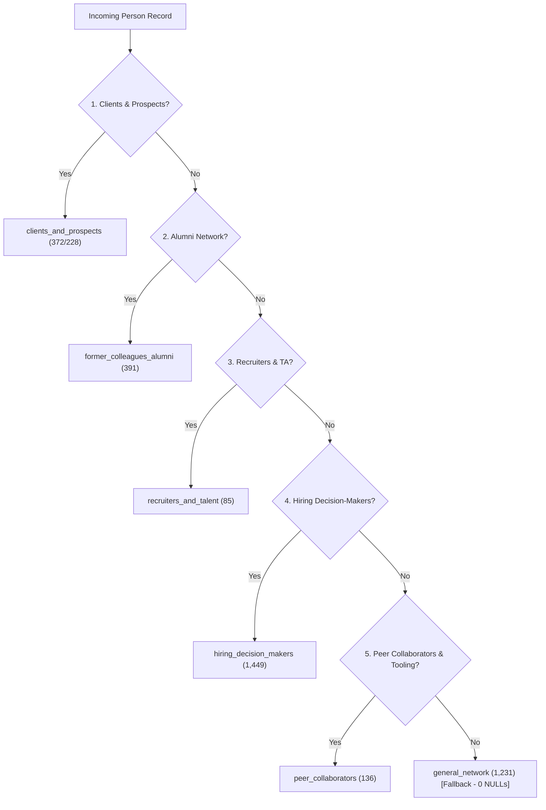

# CDP Segmentation & Engagement Temperature Architecture

This document provides a comprehensive overview of the Customer Data Platform (CDP) segmentation engine, detailing the design principles, person segments, lead segments, engagement temperature scoring, SQL rules, and database schema.

---

## 🎯 Architecture & Design Principles

The CDP segmentation engine operates under four core principles tailored for a Data Biz Consultancy network:

1. **Mutually Exclusive Classification**: Every contact in `cdp.persons` has a single primary `person_segment_id` (FK to `cdp.person_segments`), `person_segment_name`, and `person_segment_slug`.
2. **Zero NULLs Policy**: Unclassified contacts automatically fall back into the `general_network` ("General Network") segment.
3. **Denormalized Human-Readable Columns**: Direct `person_segment_name`, `person_segment_slug`, `lead_segment_name`, and `lead_segment_slug` columns exist on `cdp.persons` and `cdp.leads` to eliminate required SQL JOINs in quick reporting or downstream applications.
4. **Strict Priority Hierarchy**: Person segments evaluate in a strict priority cascade so higher-trust or high-intent segments take precedence over broader categories.

---

## 👥 Person Segments (Opportunity-Based Framework)

`cdp.persons` evaluates across 6 opportunity-based segments in the following priority order:



### Segment Definitions & Rules

| Priority | Slug | Segment Name | Target Persona & Description | Matching Criteria / SQL Logic | Live Count |
| :---: | :--- | :--- | :--- | :--- | :---: |
| **1** | `clients_and_prospects` | **Clients & Prospects** | Warm consulting lead opportunities & active/past clients | Associated lead with `inbound_service_request` or `consulting_inquiry` intent, active sales pipeline status (`in_discussion`, `proposal_sent`, `negotiating`, `won`, `active_client`), or explicit service inquiry keywords. | **228** |
| **2** | `former_colleagues_alumni` | **Alumni & Former Colleagues** | High-trust alumni network contacts | Matched company in `cdp.persons_linkedins` against target companies: **Hays**, **HelloFresh**, **Delivery Hero / Delivery Hero SE**, **Foodpanda**, **Vestiaire / Vestiaire Collective**. | **391** |
| **3** | `recruiters_and_talent` | **Recruiters & Talent Acquisition** | Talent acquisition managers, recruiters, talent partners, headhunters | Position matching `recruiter`, `recruiting`, `talent acquisition`, `talent partner`, `headhunter`, `sourcer`, `talent manager`, `talent specialist`. | **85** |
| **4** | `hiring_decision_makers` | **Hiring Decision-Makers** | C-Level executives, Founders, VPs, Directors, Heads of Data/Eng, Leads, Managers | Position matching `founder`, `co-founder`, `owner`, `partner`, `chief`, `ceo`, `cto`, `cfo`, `coo`, `cmo`, `cpo`, `cro`, `cio`, `cdo`, `vp`, `vice president`, `head`, `director`, `lead`, `manager`, `executive`, `principal`. | **1,449** |
| **5** | `peer_collaborators` | **Peer Collaborators & Agencies** | Agency owners, consultants, freelancers, tooling founders, maintainers, & DevRel | Position matching `agency`, `freelance`, `consultant`, `partner`, `advisor`, `contractor`, `devrel`, `developer advocate`, `maintainer`, `creator`, `founding engineer`, OR company matching `dlthub`, `motherduck`, `n8n`, `airbyte`, `dagster`, `prefect`, `duckdb`, `snowflake`, `databricks`, `astronomer`. | **136** |
| **6** | `general_network` | **General Network** | Fallback segment for all general network contacts & audience members | Default fallback assigned to any contact where `person_segment_id IS NULL`. Guaranteed zero NULLs across `cdp.persons`. | **1,231** |

---

## 🌡️ Engagement Temperature Scoring

Every person in `cdp.persons` is dynamically scored with an `engagement_temperature` value:

| Temperature | Icon | Scoring Rules & Criteria | Live Count |
| :--- | :---: | :--- | :---: |
| **`hot`** | 🔥 | Recorded touchpoint in `cdp.engagements` or activity in `cdp.activities` within the **last 30 days**. | **0** |
| **`warm`** | ☀️ | Touchpoint/activity within the **last 90 days** OR active in Substack subscriber export / LinkedIn connections. | **3,124** |
| **`dormant`** | 💤 | Has recorded past touchpoints/activities, but **no activity in the last 90+ days**. | **0** |
| **`cold`** | ❄️ | Zero recorded touchpoints or activities. | **169** |

---

## 💼 Lead Segments (Opportunity Pipeline)

`cdp.leads` represents sales pipeline opportunities and incoming service requests, classified into 5 lead segments:

| Slug | Lead Segment Name | Description & Evaluation Rule |
| :--- | :--- | :--- |
| `new_leads_no_followup_7d` | **New Leads No Followup 7d** | Leads in `prospect` status created $\ge 7$ days ago with zero touchpoints in `cdp.engagements`. |
| `stale_in_negotiation` | **Stale In Negotiation** | Leads in `negotiating` status with no touchpoints in the last 14 days. |
| `high_intent_inbound` | **High Intent Inbound** | Leads flagged with high intent (`high_intent`, `inbound`) or strong signal strength. |
| `contract_pending` | **Contract Pending** | Leads in `offer_accepted` stage awaiting contract execution. |
| `re_engagement_prospects` | **Re-engagement Prospects** | Leads in `nurture` status whose associated contact has recent activity in last 30 days. |

---

## ⚙️ Processor & Automation Service

The segmentation engine is executed by the CDP service processor:

- **Processor File**: [`src/cdp/processors/evaluate_segments.py`](file:///Users/jimmypang/AntigravityProjects/Jager/src/cdp/processors/evaluate_segments.py)
- **HTTP REST Endpoint**: `POST /process/evaluate_segments`
- **n8n Workflow Node**: Included in [`CDP - Lead Processing`](file:///Users/jimmypang/AntigravityProjects/Jager/src/n8n/workflows/cdp/cdp_lead_processing.json) workflow, executing automatically after intake processors finish.

### Manual CLI Execution

To run segment evaluation manually inside the Docker container:

```bash
docker compose exec cdp python processors/evaluate_segments.py
```

### Triggering via HTTP API

```bash
curl -X POST http://localhost:8000/process/evaluate_segments
```

---

## 🗄️ Database Schema Reference

### `cdp.person_segments` (Dimension Table)
```sql
CREATE TABLE cdp.person_segments (
    id UUID PRIMARY KEY DEFAULT gen_random_uuid(),
    slug VARCHAR(64) UNIQUE NOT NULL,
    name VARCHAR(128) NOT NULL,
    description TEXT,
    segment_type VARCHAR(32) DEFAULT 'dynamic',
    criteria JSONB,
    created_at TIMESTAMP WITH TIME ZONE DEFAULT NOW(),
    updated_at TIMESTAMP WITH TIME ZONE DEFAULT NOW()
);
```

### `cdp.persons` (Entity Table - Segment Columns)
```sql
ALTER TABLE cdp.persons ADD COLUMN person_segment_id UUID REFERENCES cdp.person_segments(id) ON DELETE SET NULL;
ALTER TABLE cdp.persons ADD COLUMN person_segment_name VARCHAR(128);
ALTER TABLE cdp.persons ADD COLUMN person_segment_slug VARCHAR(64);
ALTER TABLE cdp.persons ADD COLUMN engagement_temperature VARCHAR(32) DEFAULT 'cold';
```

---

## 📊 Useful SQL Queries

### 1. Person Segment Breakdown
```sql
SELECT person_segment_name, person_segment_slug, COUNT(*) 
FROM cdp.persons 
GROUP BY person_segment_name, person_segment_slug 
ORDER BY COUNT(*) DESC;
```

### 2. Engagement Temperature Breakdown
```sql
SELECT engagement_temperature, COUNT(*) 
FROM cdp.persons 
GROUP BY engagement_temperature 
ORDER BY COUNT(*) DESC;
```

### 3. High-Priority Alumni Decision Makers
```sql
SELECT first_name, last_name, primary_email, linkedin_url, person_segment_name 
FROM cdp.persons 
WHERE person_segment_slug = 'former_colleagues_alumni' 
ORDER BY last_name ASC;
```

### 4. Verify Zero NULL Segments
```sql
SELECT COUNT(*) AS null_segment_count 
FROM cdp.persons 
WHERE person_segment_id IS NULL OR person_segment_slug IS NULL;
```
