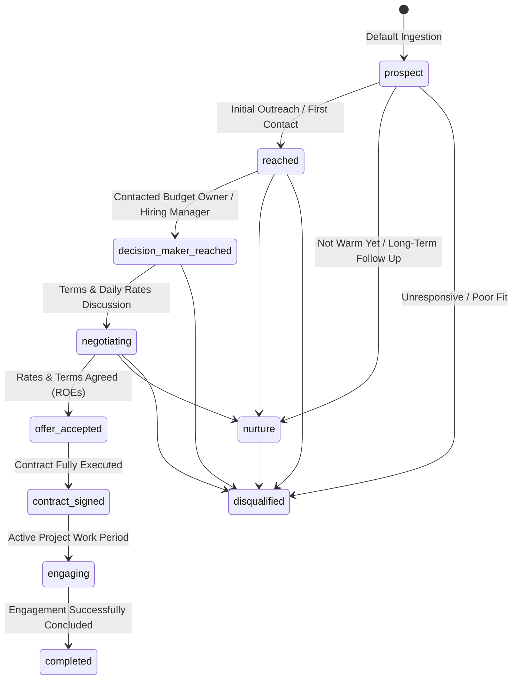

# CDP Client Accounts & Leads Status Lifecycle

This document defines the strict stage lifecycles and transitions for organizational client accounts (`cdp.client_accounts`) and lead intakes (`cdp.leads`) within the Customer Data Platform (CDP).

---

## 1. Client Account Status Lifecycle (`cdp.client_accounts.status`)

The `cdp.client_accounts` table represents prospective and active target companies. The status tracks the business relationship lifecycle from cold prospect to completed client engagement or disqualification.

### Stage Definitions (`cdp.client_accounts.status`)

| Status Value | Stage Name | Description & Trigger Criteria |
| :--- | :--- | :--- |
| `prospect` | **Prospect** | Default state upon ingestion from external sources (e.g., LinkedIn connections, raw databases). No outreach initiated yet. |
| `reached` | **First Contact Reached** | Initial contact initiated or established with anyone inside the target company. |
| `decision_maker_reached` | **Decision Maker Reached** | Successfully made contact with a key stakeholder who owns budget, manages teams, or offers contracts/roles. |
| `negotiating` | **Negotiating** | Active discussions around project scope, daily rates (e.g. EUR/day), availability timelines, and contract terms. |
| `offer_accepted` | **Offer Accepted** | Mutual verbal or written agreement on rates, scope, and Rules of Engagement (ROEs) prior to formal contract signing. |
| `contract_signed` | **Contract Signed** | Formal legal agreement / MSA / SOW fully executed by both parties. |
| `engaging` | **Actively Engaging** | Currently executing active consulting/engineering project work for the client. |
| `completed` | **Engagement Completed** | Project engagement successfully finished and delivered. |
| `nurture` | **Nurture** | Lead/Account is warm or interested, but not yet ready for immediate negotiation. Maintained for periodic follow-up. |
| `disqualified` | **Disqualified** | Catch-all terminal state for accounts resolved as unviable, unresponsive, or poor fit. |

---

## 2. Lead Status Lifecycle (`cdp.leads.status`)

The `cdp.leads` table tracks incoming lead intakes.

| Status Value | Description |
| :--- | :--- |
| `new` | Newly ingested raw lead intake. |
| `person_linked` | Lead matched to an individual contact profile in `cdp.persons`. |
| `account_linked` | Lead person resolved to an organizational account in `cdp.client_accounts`. |
| `qualified` | Lead validated as a viable business opportunity. |
| `converted` | Lead successfully converted into an active client engagement. |
| `rejected` | Lead intake disqualified or archived. |
