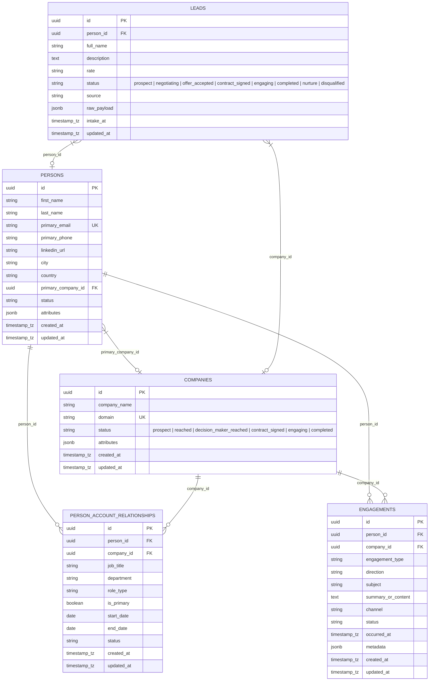

# Database Schema & Entity Relationship Diagram

This directory contains the database setup and initialization scripts for PostgreSQL database `jager`.

## CDP Schema Entity Relationship Diagram (ERD)

The `cdp` schema is the Customer Data Platform (CDP) processing/domain schema managing entity profiles, lead intake, organizational relationships, and interactions.

For detailed status definitions and stage transition diagrams, see [CDP Status Lifecycle Documentation](../cdp/README.md#status-lifecycles--state-transitions).

## Schema & Tables Overview

- **`cdp.companies`**: Accounts / organizations profiles.
- **`cdp.persons`**: Individual profiles (prospects, leads, contacts) with optional `primary_company_id` foreign key.
- **`cdp.leads_linkedin`**: Intake table for LinkedIn message-derived leads (`s_linkedin.messages`).
- **`cdp.leads_manual`**: Intake table for manual data-derived leads (`s_manual`).
- **`cdp.leads`**: Aggregated table for inbound leads, featuring a `source` column stating if the lead is from `Linkedin` or `Manual`.
- **`cdp.person_account_relationships`**: Dynamic mapping of persons to client accounts with roles (`role_type`, `job_title`, `department`) and date boundaries.
- **`cdp.engagements`**: Activity log (emails, calls, meetings, notes, form submissions, LinkedIn messages).

## Files in `src/db/`
- [init-user-db.sh](init-user-db.sh): PostgreSQL initialization script run automatically on Docker startup.
- [migrate-db.js](migrate-db.js): Database migration and DDL synchronization script.
