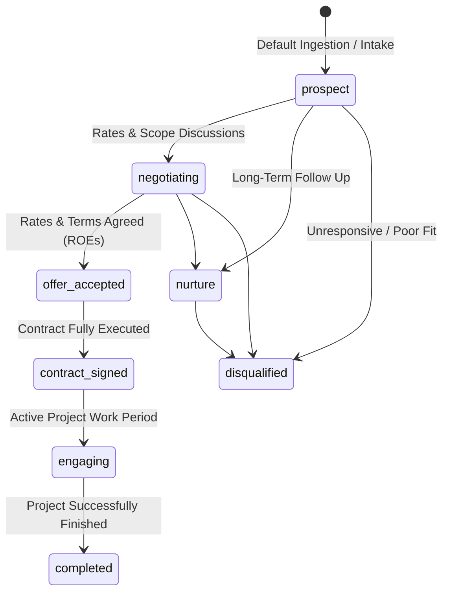
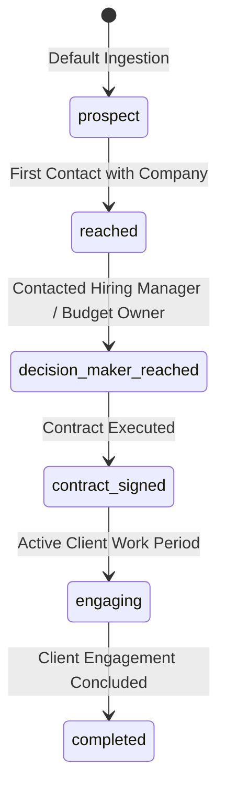

# CDP Leads & Client Accounts Status Lifecycle

This document defines the stage lifecycles and transitions for lead opportunity intakes (`cdp.leads`) and organizational client accounts (`cdp.client_accounts`) within the Customer Data Platform (CDP).

---

## 1. Lead Opportunity Status Lifecycle (`cdp.leads.status`)

The `cdp.leads` table tracks business opportunity leads. The status follows an 8-stage lifecycle from initial intake/prospecting to rate negotiation, contract execution, active engagement, nurture, or disqualification.

### Lead Stage Definitions (`cdp.leads.status`)

| Status Value | Stage Name | Description & Trigger Criteria |
| :--- | :--- | :--- |
| `prospect` | **Prospect** | Default state upon lead intake/ingestion. No negotiation initiated yet. |
| `negotiating` | **Negotiating** | Active negotiations around project scope, daily rate (EUR/day), and contract terms. |
| `offer_accepted` | **Offer Accepted** | Both sides agree on daily rate and Rules of Engagement (ROEs) before formal contract signing. |
| `contract_signed` | **Contract Signed** | MSA / SOW contract fully signed and executed. |
| `engaging` | **Actively Engaging** | Currently executing active project work during the engagement period. |
| `completed` | **Engagement Completed** | Project engagement successfully completed. |
| `nurture` | **Nurture** | Lead is not cold, but not yet ready for immediate negotiation; periodic follow-up. |
| `disqualified` | **Disqualified** | Catch-all state for disqualified, unresponsive, or unviable leads. |

---

## 2. Client Account Status Lifecycle (`cdp.client_accounts.status`)

The `cdp.client_accounts` table represents target organizations. It follows a streamlined 6-stage lifecycle tracking the overall company-level relationship.

### Client Account Stage Definitions (`cdp.client_accounts.status`)

| Status Value | Stage Name | Description & Trigger Criteria |
| :--- | :--- | :--- |
| `prospect` | **Prospect** | Default state upon company ingestion. No active contact established yet. |
| `reached` | **Reached** | Initial contact established with company representative(s). |
| `decision_maker_reached` | **Decision Maker Reached** | Contact established with key stakeholder who owns budget or hires for roles. |
| `contract_signed` | **Contract Signed** | Formal organization-level contract / SOW signed. |
| `engaging` | **Actively Engaging** | Company currently has active ongoing engagement/work. |
| `completed` | **Completed** | Company engagement successfully finished. |
