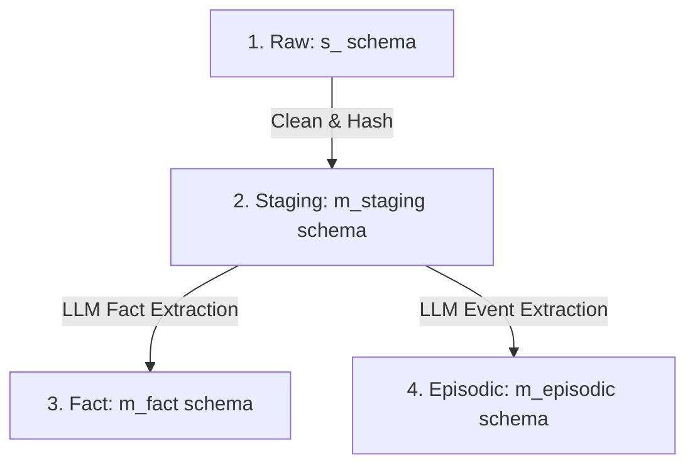

# AI Memory & Entity-Centric Learning (ECL) Conventions

This directory contains the workflows that drive Jager's AI capabilities. This document outlines the architectural conventions introduced for **AI Memory / Entity-Centric Learning (ECL)** using the **Distillion Pattern**.

---

## Architectural Pattern

To avoid hardcoded, context-sparse prompting across various workflows, content from data sources is systematically distilled through four layers:

### 1. Raw Layer (`s_` schemas)
*   **Purpose**: Stores raw ingested data as-is from external APIs (Notion, Substack, LinkedIn posts, etc.).
*   **State**: Records are added with a default `processed = 0`.
*   **Conventions**: Schema namespace format: `s_{source}` (e.g., `s_notion.pages`, `s_substack.posts`).

### 2. Staging Layer (`m_staging` schema)
*   **Purpose**: Stores normalized, sanitized, and categorized content.
*   **Deduplication**: Content is cleaned and deduplicated using a SHA-256 hash. The `content_hash` acts as the **Primary Key** to prevent inserting duplicate text across different IDs or platforms.
*   **Classification**: An LLM classifies the content into distinct categories (e.g., `AI / ML`, `Software Engineering`, `Business Strategy`).
*   **Tables**: 
    *   `m_staging.notion_pages` (1:1 with `s_notion.pages`)
    *   `m_staging.substack_posts` (1:1 with `s_substack.posts`)
    *   `m_staging.linkedin_posts` (1:1 with `s_linkedin.ugc_posts`)

### 3. Fact Layer (`m_fact` schema)
*   **Purpose**: Stores long-term, static facts and profile details about entities (people, organizations, technology stacks, concepts).
*   **ECL Extraction**: The LLM extracts statements like:
    *   *Entity Name*: "Gemini 3.5" | *Type*: "technology" | *Details*: "Google's next-gen language model featuring high efficiency."
*   **Table**: `m_fact.memory_facts`

### 4. Episodic Layer (`m_episodic` schema)
*   **Purpose**: Stores specific events, interactions, decisions, and outcomes tied to time and context (e.g., meetings, post publish events, milestones).
*   **Table**: `m_episodic.memory_events`

---

## Workflow Implementation

The pipeline is implemented in [ai_memory_ecl.json](file:///Users/jimmypang/AntigravityProjects/Jager/src/n8n/workflows/ai_memory_ecl.json):
1.  **Ingestion Window**: Triggered daily, utilizing a `Set` node to establish a sliding 1-day range parameters.
2.  **Polymorphic Tracing**: When facts and episodes are written, they reference the source via `source_table` and `source_id` (which matches the staging table's `content_hash`), allowing any fact or event to trace back to its origin.
