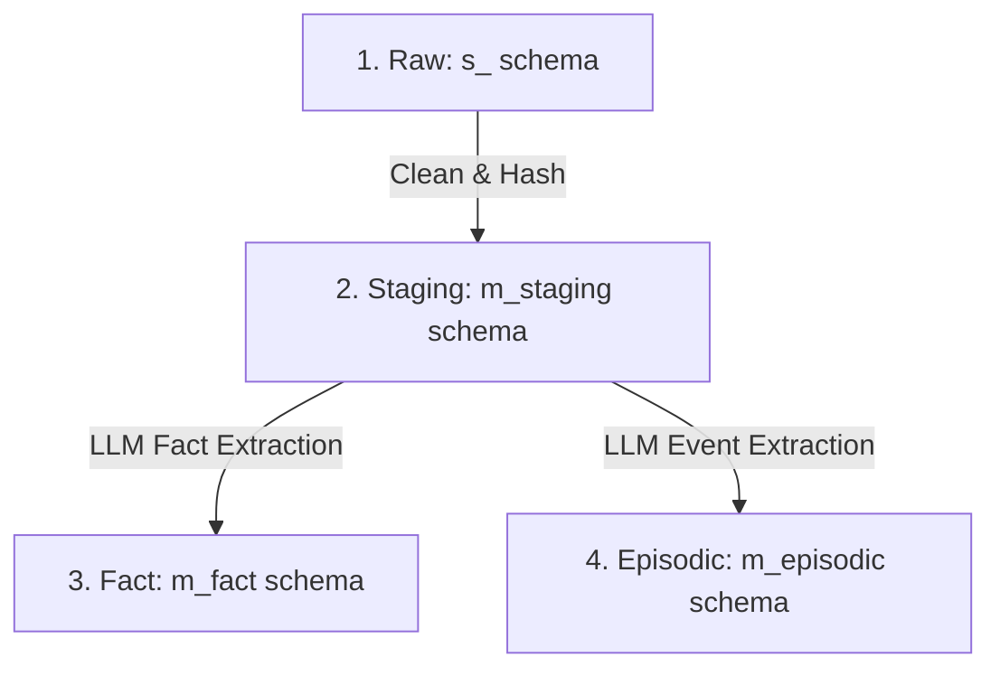

# AI Memory & Entity-Centric Learning (ECL)

This directory contains workflows driving Jager's AI memory capabilities using the **Distillion Pattern**.

---

## 🏛️ Four-Layer Memory Architecture

1. **Raw Layer (`s_*`)**: Stores unmodified records from external APIs with `processed = 0`.
2. **Staging Layer (`m_staging`)**: Normalised and deduplicated using SHA-256 `content_hash` primary keys.
3. **Fact Layer (`m_fact`)**: Static profile facts and entity knowledge extracted by LLMs (`m_fact.memory_facts`).
4. **Episodic Layer (`m_episodic`)**: Context-aware events, touchpoints, and timeline decisions (`m_episodic.memory_events`).

---

## 📋 Implementation

- **Workflow File**: [`ai_memory_ecl.json`](ai_memory_ecl.json) (runs daily with 1-day sliding window and polymorphic tracing).
