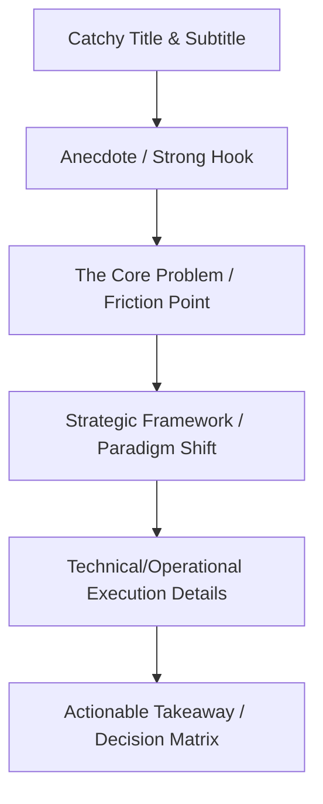

# Substack Post Creation Structure & Style Guide ✍️

Use this guide when generating Substack article/newsletter drafts for Jimmy Pang's **Data Biz** publication.

---

## 1. Core Structural Framework

Every Substack article must follow this precise progression:

### **1. Title & Subtitle**
*   **Title Style:** Punchy, contrarian, or guide-focused (e.g., *"Agile for Data Leaders, Not Scrum Masters"*, *"We need to talk more about Vibe Analytics"*).
*   **Subtitle Style:** Explains the concrete ROI, what the reader will learn, and the stakes (e.g., *"Why your team wastes 6 figures a year on dashboard maintenance — and what to do about it"*).

### **2. The Opening Hook (Anecdote or Hot Take)**
*   **Option A: The Operator's War Story:** Start in media res with a narrative anecdote from a scaling tech company (e.g., *"Picture Berlin, a few years ago. A French second-hand luxury marketplace..."*). Detail the high-stress environment, stakeholder pressure, and what was at stake.
*   **Option B: The Direct Call-Out:** Call out a massive industry waste or misconception immediately (e.g., *"What the hell is Vibe Analytics? We’re wasting billions on dashboard graveyards."*).

### **3. The Core Concept / Strategic Framing (The H2 Section)**
*   Define the vocabulary and explain *why* the old way is failing (e.g., Kimball dimensional modeling failing on modern OLAP like Snowflake/BigQuery; text-to-SQL failing without a semantic layer).
*   Connect technical concepts directly to business metrics like EBITDA, ROI, time-to-decision, and trust.

### **4. Technical & Operational Execution (The H3 Sections)**
*   Provide concrete implementation details that appeal to Senior ICs and Data Managers (e.g., dbt MetricFlow, Cube, LookML, Snowflake warehouse optimization, Agile sprint backlogs for data).
*   Use structured tables, bullet points, or list structures to make comparisons easily scannable.

### **5. Actionable Outro / Matrix**
*   End with a clear framework, decision tree, or checklist the reader can copy and apply to their team tomorrow (e.g., Stakeholder Power-Interest Grid, Data Mart Typology, Prioritization Decision Tree).

---

## 2. Tone, Style & Voice Rules

*   **First-Person Operator Perspective:** Write as Jimmy Pang ("I", "my", "we"). The tone must be that of a battle-tested executive and hands-on operator (Berlin-based, ex-HelloFresh, Vestiaire Collective, Delivery Hero, Foodpanda).
*   **Conversational yet Authoritative:** Expert and visionary, but completely allergic to corporate fluff, passive voice, and deck theatre. Use strong, direct verbs (e.g., *"firefighting a million-euro reporting gap"*, *"BI without the BS"*, *"dashboard graveyards"*).
*   **Pragmatic & Anti-Hype:** Always ground opinions in operational realities, performance metrics, and cost-benefit analysis.

---

## 3. Formatting Standards

*   Use Markdown headers (`#`, `##`, `###`) logically.
*   Emphasize key takeaways with **bolding** and *italics*.
*   Use bulleted or numbered lists for step-by-step guides.
*   Ensure the code snippets or terminal commands are enclosed in fenced code blocks.
*   **Article Length:** The ideal length per article is 2000-2500 words.
*   **Article Format:** Must be written in valid Markdown syntax.

